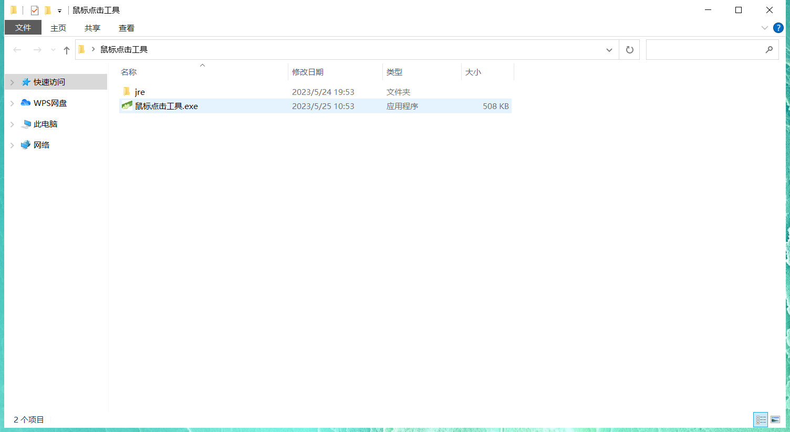
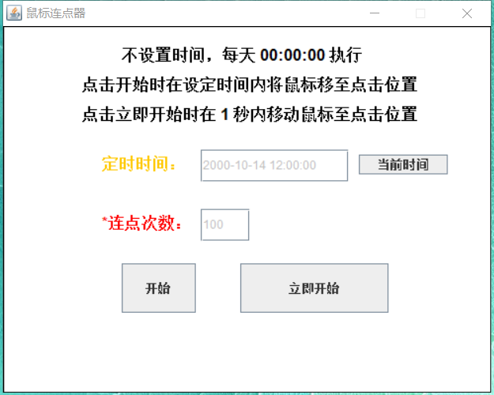

# MouseConnectator

#### 介绍
鼠标点击工具

#### 安装教程

1.  下载 鼠标点击工具.zip。
2.  解压压缩包。
3.  双击其中exe文件即可运行。
- 

#### 使用说明

- 
1.  压缩包解压完文件中的 **jre文件夹** 为运行环境（此文件夹可保证在没有安装jdk或jre的系统上运行），不可删除，必须保证与exe文件在同一级别的目录下。
2.  连点次数为**必输**项。
3.  不设置时间时，默认在当天晚上的 **0** 点执行。
4.  **当前时间** 按钮可以在定时时间输入框中显示当前时间。
5.  **两种执行方式**
    - 点击 **开始** 按钮需要设置定时时间以及连点次数。将会在设置的时间内自动模拟鼠标点击，次数为设置的连点次数。
    - 点击 **立即开始** 按钮会在点击按钮的 **1** 秒钟之后自动模拟鼠标点击，次数为设置的连点次数。
6.  点击 **开始** 或 **立即开始** 按钮后，按钮将变为不可点击状态，按钮下方将会显示设置的点击的时间和次数信息。当上次的任务执行完成后按钮才会变为可点击状态。如果需要放弃上次的任务，只需关闭程序即可。